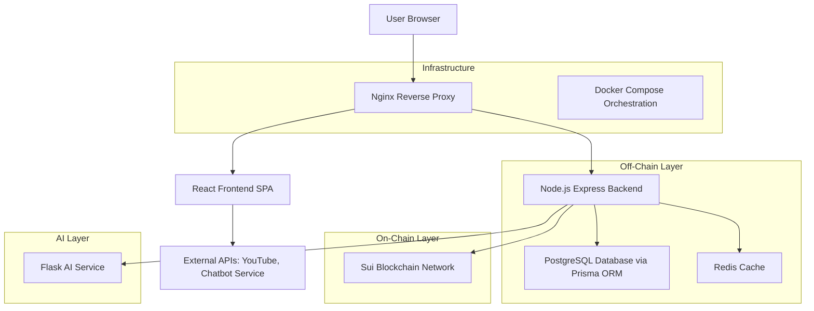

# SACCOChain – Hybrid Blockchain Credit Platform

A full-stack platform for SACCOs (Savings and Credit Cooperative Organizations) that combines off-chain efficiency with on-chain transparency and AI-powered credit scoring. This hybrid system ensures fast, private operations while providing verifiable trust through blockchain proofs.

## Table of Contents
- [Executive Summary](#1-executive-summary)
- [Problem Statement](#2-problem-statement)
- [Solution Overview](#3-solution-overview)
- [Why Now](#4-why-now)
- [Value Proposition](#5-value-proposition)
- [Features](#6-features)
- [System Architecture](#7-system-architecture)
- [Technology Stack](#8-technology-stack)
- [Data Model](#9-data-model)
- [API Reference](#10-api-reference)
- [Project Structure](#11-project-structure)
- [Environment Variables](#12-environment-variables)
- [Local Development Setup](#13-local-development-setup)
- [Docker Deployment](#14-docker-deployment)
- [Security & Compliance](#15-security--compliance)
- [Roadmap](#16-roadmap)
- [Contributing](#17-contributing)
- [License](#18-license)

---

## 1. Executive Summary

SACCOChain is a comprehensive fintech platform designed to modernize SACCO operations by integrating blockchain technology for immutable credit proofs, AI for intelligent credit scoring, and a user-friendly web interface for members and administrators. The platform addresses key challenges in the SACCO ecosystem through a hybrid approach: off-chain for performance and privacy, on-chain for trust and verifiability.

---

## 2. Problem Statement

### Non-Technical Perspective
- **Duplicate Borrowing**: Members can borrow from multiple SACCOs without institutions knowing, leading to over-indebtedness and higher default risks.
- **Slow Credit Checks**: Reliance on centralized credit bureaus (CRB) causes delays in loan approvals, especially for rural SACCOs.
- **Lack of Transparency**: Members have limited visibility into how credit decisions are made, eroding trust.
- **High Operational Costs**: Small and rural SACCOs lack affordable digital tools for member management, transaction processing, and risk assessment.
- **Data Privacy Concerns**: Sharing member data across institutions is risky and often restricted by regulations.
- **Limited Interoperability**: SACCOs operate in silos, unable to leverage collective insights for better decision-making.

### Technical Perspective
- Centralized databases lead to single points of failure and scalability issues.
- Manual credit scoring processes are time-consuming and prone to bias.
- Lack of standardized APIs for SACCO integrations.
- Absence of verifiable, tamper-proof credit histories.

---

## 3. Solution Overview

SACCOChain implements a hybrid blockchain-credit scoring platform with the following components:

### Off-Chain Layer (Performance & Privacy)
- **Node.js Backend**: Handles user authentication, transaction processing, and API management.
- **PostgreSQL Database**: Stores sensitive member data, transaction histories, and credit scores securely.
- **Redis Cache**: Improves performance for frequently accessed data and session management.

### On-Chain Layer (Trust & Verifiability)
- **Sui Blockchain**: Anchors cryptographic hashes of credit scores and events for immutable proof.
- **Move Smart Contracts**: Define rules for credit registries, SACCO registrations, and oracle integrations.

### AI Layer (Intelligence)
- **Flask Microservice**: Provides machine learning-based credit scoring using behavioral data.
- **Model Training**: Generates realistic datasets and trains models for accurate risk assessment.

### User Interface Layer
- **React Frontend**: Modern SPA with multilingual support, dark mode, and responsive design.
- **Landing Page**: Marketing site with explainer video, newsletter signup, and chatbot integration.

### Infrastructure Layer
- **Docker Compose**: Orchestrates all services for easy deployment.
- **Nginx Reverse Proxy**: Serves the frontend and proxies API requests with security headers.

---

## 4. Why Now

The timing for SACCOChain is optimal due to several converging trends:

- **Blockchain Maturity**: Sui's high-throughput, low-fee blockchain provides a practical foundation for real-world financial applications.
- **AI Accessibility**: Affordable machine learning tools and pre-trained models enable sophisticated credit scoring without massive computational resources.
- **Digital Transformation**: SACCOs are increasingly adopting digital solutions, driven by mobile banking growth and regulatory pressures.
- **Fintech Innovation**: Open-source tools and cloud infrastructure make building scalable fintech platforms more feasible for smaller organizations.
- **Regulatory Support**: Growing recognition of blockchain's role in financial inclusion and transparency.

---

## 5. Value Proposition

### For SACCO Members
- **Portable Credit History**: Verifiable reputation that travels across institutions.
- **Faster Loan Approvals**: AI-driven scoring reduces processing time.
- **Increased Transparency**: Clear visibility into credit decisions and scores.
- **Privacy Protection**: Personal data remains off-chain; only proofs are shared.

### For SACCO Administrators
- **Reduced Risk**: Better credit assessment through AI and cross-institutional data.
- **Operational Efficiency**: Automated workflows and digital dashboards.
- **Cost Savings**: Affordable SaaS alternative to expensive proprietary systems.
- **Regulatory Compliance**: Built-in audit trails and verifiable records.

### For Regulators and Partners
- **Interoperability**: Standardized APIs for integration with credit bureaus and banks.
- **Risk Monitoring**: Aggregate insights across the SACCO ecosystem.
- **Innovation Platform**: Extensible architecture for future fintech developments.

---

## 6. Features

### Landing Page Experience
- **Multilingual Support**: English and Swahili translations using react-i18next.
- **Dark Mode Toggle**: Automatic theme switching with user preference persistence.
- **Interactive Sections**: Hero, Features, How It Works, Technology, Testimonials, Newsletter, CTA, Footer.
- **Newsletter Signup**: Integrated with backend API for email collection.
- **Explainer Video Modal**: Embedded YouTube video for product demonstration.
- **Chatbot Integration**: Toggleable widget for user assistance.

### Authentication & Authorization
- **JWT-Based Sessions**: Secure token authentication with refresh mechanisms.
- **Role-Based Access**: ADMIN, MEMBER, AUDITOR roles with appropriate permissions.
- **Profile Management**: User registration, login, and profile updates.

### Member Dashboard
- **Transaction History**: View and filter personal transactions.
- **Credit Score Display**: Real-time credit score with risk level indicators.
- **Loan Applications**: Submit and track loan requests.
- **Analytics**: Personal financial insights and trends.

### Admin Dashboard
- **System Analytics**: Platform-wide statistics and KPIs.
- **User Management**: Member administration and role assignments.
- **SACCO Oversight**: Manage multiple SACCOs and their configurations.
- **Transaction Monitoring**: Audit and approve high-value transactions.

### AI Credit Scoring
- **Behavioral Analysis**: Scores based on transaction patterns, savings history, and repayment behavior.
- **Machine Learning Models**: Gradient Boosting and Random Forest algorithms.
- **Rule-Based Fallback**: Ensures scoring availability even without ML models.
- **Explainability**: Feature importance analysis for transparent decisions.

### Blockchain Integration
- **Credit Proof Anchoring**: Immutable hashes of credit scores on Sui blockchain.
- **Verification APIs**: Cross-institutional proof validation without data sharing.
- **SACCO Registration**: On-chain SACCO entity creation and management.
- **Wallet Integration**: Sui wallet connectivity for advanced users.

### API Ecosystem
- **RESTful Endpoints**: Comprehensive API for all platform functions.
- **Webhook Support**: Real-time notifications for external integrations.
- **Rate Limiting**: Protects against abuse and ensures fair usage.

---

## 7. System Architecture



### Component Interactions
1. **User Interaction**: Frontend handles UI rendering and API calls.
2. **Authentication Flow**: JWT tokens validated by backend middleware.
3. **Credit Scoring**: Backend aggregates user data, sends to AI service, stores results.
4. **Blockchain Anchoring**: Backend creates hashes and submits to Sui network.
5. **Data Persistence**: Prisma manages database operations with migrations and seeding.
6. **Caching**: Redis stores session data and frequently accessed information.

---

## 8. Technology Stack

### Backend (Node.js)
- **Framework**: Express.js for REST API development.
- **ORM**: Prisma for type-safe database operations.
- **Authentication**: JSON Web Tokens (JWT) with bcrypt hashing.
- **Validation**: Joi schemas for request validation.
- **Security**: Helmet, CORS, rate limiting, input sanitization.
- **Caching**: Redis for session and data caching.
- **Logging**: Winston for structured logging.
- **Testing**: Jest with Supertest for API testing.

### Frontend (React)
- **Build Tool**: Vite for fast development and optimized builds.
- **Styling**: Tailwind CSS for utility-first styling.
- **State Management**: React Context for global state.
- **Routing**: React Router for SPA navigation.
- **Internationalization**: react-i18next for multilingual support.
- **Forms**: Controlled components with validation.
- **Testing**: Vitest for unit and integration tests.

### AI Service (Python)
- **Framework**: Flask for microservice architecture.
- **ML Libraries**: scikit-learn for machine learning models.
- **Data Processing**: pandas and NumPy for data manipulation.
- **Model Persistence**: joblib for model serialization.
- **API**: RESTful endpoints with JSON responses.
- **Training**: Custom scripts for data generation and model training.

### Blockchain (Sui)
- **Language**: Move for smart contract development.
- **SDK**: Sui TypeScript SDK for backend integration.
- **Contracts**: Custom modules for credit registries and SACCO management.
- **Wallet**: Sui wallet integration for user interactions.
- **Deployment**: Scripts for contract compilation and deployment.

### Infrastructure
- **Containerization**: Docker for service isolation.
- **Orchestration**: Docker Compose for multi-service management.
- **Reverse Proxy**: Nginx for load balancing and SSL termination.
- **Database**: PostgreSQL for relational data storage.
- **Cache**: Redis for high-performance data caching.
- **SSL/TLS**: Certificate management for secure communications.

### Development Tools
- **Version Control**: Git with conventional commits.
- **CI/CD**: GitHub Actions for automated testing and deployment.
- **Code Quality**: ESLint, Prettier for code formatting.
- **Documentation**: JSDoc for API documentation.
- **Monitoring**: Health checks and logging aggregation.

---

## 9. Data Model

The platform uses Prisma ORM with PostgreSQL. Key models include:

### User Model
```prisma
model User {
  id            String   @id @default(cuid())
  email         String   @unique
  name          String
  password      String
  nationalId    String?  @unique
  walletAddress String?
  role          Role     @default(MEMBER)
  creditScore   Float?   @default(0)
  saccoId       String?
  sacco         Sacco?   @relation(fields: [saccoId], references: [id])
  transactions  Transaction[]
  creditScores  CreditScore[]
  createdAt     DateTime @default(now())
  updatedAt     DateTime @updatedAt
}
```

### Transaction Model
```prisma
model Transaction {
  id          String        @id @default(cuid())
  type        TransactionType
  amount      Float
  status      TransactionStatus @default(PENDING)
  description String?
  userId      String
  user        User          @relation(fields: [userId], references: [id])
  createdAt   DateTime      @default(now())
}
```

### CreditScore Model
```prisma
model CreditScore {
  id          String   @id @default(cuid())
  score       Float
  riskLevel   String
  userId      String
  user        User     @relation(fields: [userId], references: [id])
  onChainHash String?
  createdAt   DateTime @default(now())
}
```

### Sacco Model
```prisma
model Sacco {
  id        String   @id @default(cuid())
  name      String   @unique
  licenseNo String   @unique
  users     User[]
  createdAt DateTime @default(now())
}
```

### NewsletterSubscription Model
```prisma
model NewsletterSubscription {
  id        String   @id @default(cuid())
  email     String   @unique
  createdAt DateTime @default(now())
}
```

---

## 10. API Reference

### Authentication Endpoints
- `POST /api/auth/register` - User registration
- `POST /api/auth/login` - User login
- `GET /api/auth/profile` - Get user profile
- `PUT /api/auth/profile` - Update user profile

### SACCO Management
- `GET /api/sacco` - List SACCOs
- `POST /api/sacco` - Create SACCO
- `GET /api/sacco/:id` - Get SACCO details
- `PUT /api/sacco/:id` - Update SACCO

### Credit Scoring
- `POST /api/score/calculate/:userId` - Calculate credit score
- `GET /api/score/history/:userId` - Get credit score history

### Blockchain Operations
- `POST /api/sui/store-score` - Anchor credit score hash on-chain
- `GET /api/sui/verify-score/:creditScoreId` - Verify on-chain proof
- `POST /api/sui/register-sacco` - Register SACCO on-chain

### Transactions
- `GET /api/transactions/:userId` - Get user transactions
- `POST /api/transactions` - Create transaction
- `PATCH /api/transactions/:id/status` - Update transaction status

### Admin Operations
- `GET /api/admin/stats` - Get platform statistics
- `GET /api/admin/users` - List all users
- `PATCH /api/admin/users/:id/role` - Update user role

### Newsletter
- `POST /api/newsletter/subscribe` - Subscribe to newsletter

### Health Checks
- `GET /health` - Backend health check
- `GET /api/health` - AI service health check

---

## 11. Project Structure

```
saccochain/
├── docker-compose.yml          # Multi-service orchestration
├── README.md                   # This file
├── backend/                    # Node.js API server
│   ├── Dockerfile              # Development container
│   ├── Dockerfile.prod         # Production container
│   ├── package.json            # Dependencies and scripts
│   ├── prisma/                 # Database schema and migrations
│   │   ├── schema.prisma       # Data models
│   │   ├── seed.js             # Database seeding
│   │   └── migrations/         # Migration files
│   └── src/                    # Source code
│       ├── app.js              # Express app configuration
│       ├── server.js           # Server startup
│       ├── config/             # Configuration files
│       ├── routes/             # API route handlers
│       ├── middleware/         # Custom middleware
│       ├── services/           # Business logic services
│       ├── utils/              # Utility functions
│       ├── jobs/               # Background jobs
│       ├── health/             # Health check endpoints
│       └── tests/              # Unit and integration tests
├── frontend/                   # React SPA
│   ├── Dockerfile              # Development container
│   ├── Dockerfile.prod         # Production container
│   ├── package.json            # Dependencies and scripts
│   ├── vite.config.js          # Build configuration
│   ├── tailwind.config.js      # Styling configuration
│   ├── index.html              # HTML template
│   └── src/                    # Source code
│       ├── main.jsx            # App entry point
│       ├── App.jsx             # Main app component
│       ├── pages/              # Page components
│       ├── components/         # Reusable components
│       ├── context/            # React context providers
│       ├── hooks/              # Custom hooks
│       ├── services/           # API service functions
│       ├── utils/              # Utility functions
│       ├── locales/            # Translation files
│       └── i18n.js             # Internationalization config
├── ai-service/                 # Python ML service
│   ├── Dockerfile              # Development container
│   ├── Dockerfile.prod         # Production container
│   ├── requirements.txt        # Python dependencies
│   ├── app.py                  # Flask application
│   └── train_model.py          # Model training script
├── blockchain/                 # Sui Move contracts
│   ├── Move.toml               # Package configuration
│   ├── sources/                # Smart contract source files
│   │   ├── sacco_registry.move # SACCO registration contract
│   │   ├── credit_registry.move # Credit score registry
│   │   └── credit_oracle.move  # Oracle contract
│   └── scripts/                # Deployment and test scripts
├── nginx/                      # Reverse proxy configuration
│   ├── nginx.conf              # Nginx configuration
│   └── ssl/                    # SSL certificates (not included)
└── scripts/                    # Utility scripts
    ├── setup.sh                # Development environment setup
    └── deploy.sh               # Production deployment
```

---

## 12. Environment Variables

### Backend (.env)
```bash
DATABASE_URL=postgresql://user:password@db:5432/saccochain
JWT_SECRET=your-super-secure-jwt-secret
AI_SERVICE_URL=http://ai-service:5000
REDIS_URL=redis://redis:6379
SUI_NODE_URL=https://fullnode.mainnet.sui.io:443
SUI_PACKAGE_ID=0x... # After contract deployment
SUI_PRIVATE_KEY=... # For on-chain operations
```

### Frontend (.env)
```bash
VITE_API_URL=http://localhost:3001 # Local development
# VITE_API_URL=/api # Production (relative to Nginx)
```

### Docker Compose
```yaml
environment:
  - DB_PASSWORD=your-db-password
  - JWT_SECRET=your-jwt-secret
  # ... other variables
```

---

## 13. Local Development Setup

### Prerequisites
- Node.js 18+
- Python 3.9+
- Docker and Docker Compose
- Sui CLI (for blockchain development)

### Backend Setup
```bash
cd backend
npm install
npx prisma generate
npx prisma db push
npm run db:seed
npm run dev
```

### Frontend Setup
```bash
cd frontend
npm install
npm run dev
```

### AI Service Setup
```bash
cd ai-service
pip install -r requirements.txt
python app.py
```

### Blockchain Setup
```bash
cd blockchain
sui move build
# Deploy contracts and set SUI_PACKAGE_ID
```

### Full Stack with Docker
```bash
docker-compose build
docker-compose up -d
```

---

## 14. Docker Deployment

### Production Build
```bash
docker-compose -f docker-compose.yml build
docker-compose -f docker-compose.yml up -d
```

### SSL Configuration
1. Obtain SSL certificates (Let's Encrypt or commercial)
2. Place certificates in `nginx/ssl/`
   - `saccochain.crt`
   - `saccochain.key`
3. Update `nginx/nginx.conf` for SSL termination

### Scaling
```bash
docker-compose up -d --scale backend=3
```

### Monitoring
- Health checks: `GET /health` and `GET /api/health`
- Logs: `docker-compose logs -f [service]`

---

## 15. Security & Compliance

### Authentication & Authorization
- JWT tokens with expiration and refresh mechanisms
- Password hashing using bcrypt
- Role-based access control (RBAC)

### Data Protection
- PII stored off-chain in encrypted PostgreSQL
- On-chain data limited to cryptographic hashes
- GDPR/CCPA compliance considerations

### API Security
- Rate limiting to prevent abuse
- Input validation and sanitization
- CORS configuration for allowed origins
- Helmet for security headers

### Infrastructure Security
- Non-root Docker containers
- Network segmentation via Docker networks
- SSL/TLS encryption for all communications
- Regular security updates and dependency scanning

### Compliance
- Financial data handling standards
- Audit logging for all transactions
- Data retention policies
- Privacy by design principles

---

## 16. Roadmap

### Phase 1 (Current): MVP
- ✅ Hybrid credit scoring platform
- ✅ Basic blockchain integration
- ✅ Web dashboard and landing page
- ✅ Multi-language support

### Phase 2: Enhancement (Q2 2024)
- Mobile app (React Native)
- Advanced ML models with explainability
- Integration with external credit bureaus
- Real-time transaction monitoring

### Phase 3: Expansion (Q3 2024)
- USSD/WhatsApp integration for rural access
- Deeper Sui object models for complex financial instruments
- Partner API ecosystem
- Regulatory reporting dashboard

### Phase 4: Scale (Q4 2024)
- Multi-cloud deployment options
- Advanced analytics and AI insights
- International expansion
- Institutional-grade security certifications

---

## 17. Contributing

1. Fork the repository
2. Create a feature branch (`git checkout -b feature/amazing-feature`)
3. Commit your changes (`git commit -m 'Add amazing feature'`)
4. Push to the branch (`git push origin feature/amazing-feature`)
5. Open a Pull Request

### Development Guidelines
- Follow conventional commit messages
- Write tests for new features
- Update documentation for API changes
- Ensure code passes linting and formatting

---

## 18. License

This project is licensed under the MIT License - see the [LICENSE](LICENSE) file for details.

---

For more information or support, please contact the development team or open an issue in this repository.
